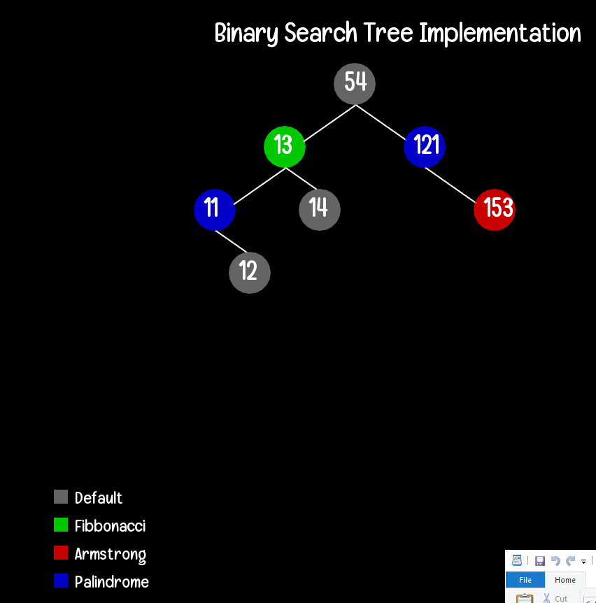

# dataVisualization
Data Structures Visualization in C++ using SFML library.

This repository includes data structures implementation with visualization.
Visualization is done with SFML Library which you'll need if you want to run the code.
You can set it up from their website. https://www.sfml-dev.org/download.php

Following Data Structures have been implemented and visualised for now.

LINKED LISTS
STACK
Binary Search Trees

